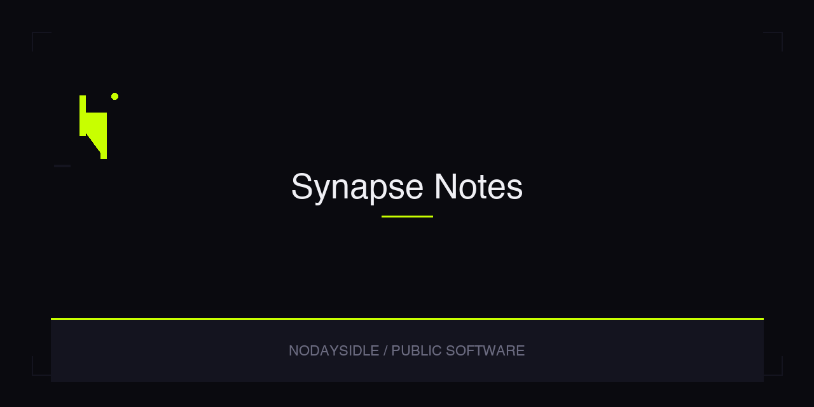

# Synapse Notes

> Voice-first notes with AI transcription, generated visuals, semantic search, and a 3D knowledge graph.


## Overview

Synapse Notes turns spoken thoughts into searchable, connected notes. Record a voice note, transcribe it through AI, generate a visual companion, embed the transcript for semantic search, and explore related notes in a 3D graph.

This repository contains the React/Vite frontend, Capacitor Android shell, Supabase edge functions, and database migrations.

## Features

- Voice recording with waveform feedback
- AI transcription through Supabase Edge Functions
- AI image generation for note visuals
- Semantic search backed by pgvector embeddings
- 3D graph view powered by Three.js
- Start using the workspace without creating an account
- Android app shell via Capacitor
- Web build via Vite

## Architecture

```text
Record voice
  → upload audio to Supabase Storage
  → transcribe through Supabase Edge Function
  → generate image + embedding
  → store note, media, and vector data in Supabase/Postgres
  → surface notes through search, gallery, and graph views
```

## Technology

| Area | Technology |
|------|------------|
| Frontend | React 18, TypeScript, Vite 5, Tailwind CSS 3 |
| Mobile | Capacitor 8 (Android) |
| 3D Graph | Three.js |
| Backend | Supabase (PostgreSQL, Storage, Realtime, Edge Functions) |
| Vector search | pgvector |
| AI | Provider-backed transcription, image generation, and embeddings via edge functions |

## Requirements

- Node.js 18 or later
- Android Studio and Android SDK (for APK builds)
- Supabase project credentials
- Provider API keys configured in Supabase function secrets

## Development

Copy the environment template:

```bash
cd frontend
cp .env.example .env
```

Set `VITE_SUPABASE_URL` and `VITE_SUPABASE_ANON_KEY`.

### Web build

```bash
cd frontend
npm ci
npm run typecheck
npm run build
```

### Android debug APK

```bash
cd frontend
npm ci
npm run build
npx cap sync android
cd android
./gradlew assembleDebug
```

Output: `frontend/android/app/build/outputs/apk/debug/app-debug.apk`

## Supabase Functions

Deploy edge functions after configuring secrets:

```bash
npx supabase functions deploy transcribe --no-verify-jwt
npx supabase functions deploy generate-image --no-verify-jwt
npx supabase functions deploy generate-embedding --no-verify-jwt
npx supabase functions deploy semantic-search --no-verify-jwt
npx supabase functions deploy ask-notes --no-verify-jwt
```

## Project Structure

```text
synapse-notes/
├── frontend/              # React/Vite app and Capacitor Android project
│   ├── src/               # app routes, components, hooks, contexts, Supabase client
│   ├── android/           # Capacitor Android native shell
│   └── package.json
├── supabase/
│   ├── functions/         # Deno edge functions
│   └── migrations/        # database schema, RLS, pgvector migrations
├── shared/types/          # shared TypeScript types
├── docs/                  # implementation notes
├── AGENTS.md              # agent instructions
└── codemap.md             # architecture map
```

## Release

GitHub releases at [github.com/nodaysidle/synapse-notes/releases](https://github.com/nodaysidle/synapse-notes/releases). The first release is a verified debug APK for testing and side-loading. Not Play Store signed.

## Status

Prototype — functional web and Android builds. Supabase backend required. Not production-hardened.

## Contributing

This repository is not currently accepting external contributions.

## License

MIT
